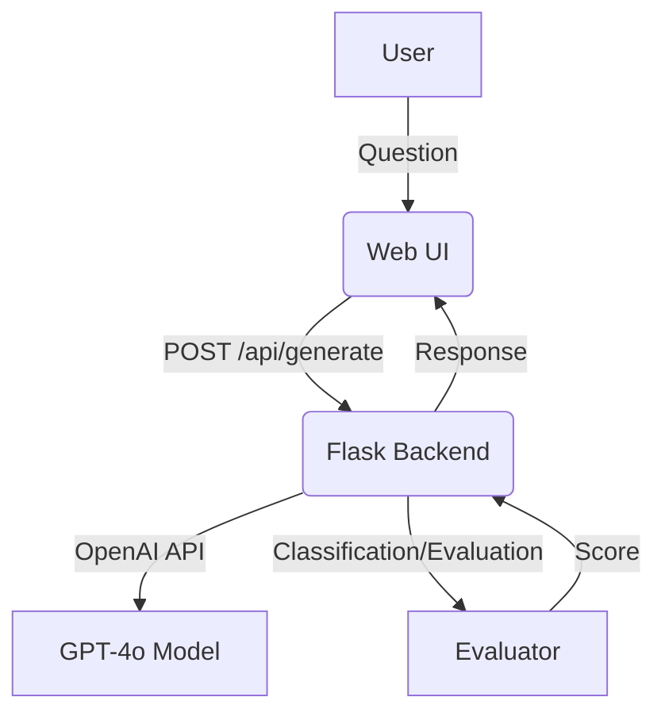

# LawLiet

**LawLiet** is an AI-powered chatbot that answers queries about Indian legal documents. Built with Flask and OpenAI's GPT-4o, it provides instant legal explanations, document classification, and response evaluation—all via a simple web interface.

---

## ✨ Features

- **Intelligent Q&A:** Ask questions about Indian legal documents (wills, contracts, NDAs, etc.) and get clear, plain-language answers.
- **Document Classification:** Automatically identifies and classifies the type of legal document.
- **Response Evaluation:** Built-in evaluation tools for benchmarking chatbot responses.
- **API Rate Limiting:** Prevents abuse by limiting request rates.
- **Easy Deployment:** Frontend can be deployed on Vercel; backend supports Render, Railway, and other PaaS.

---

## 🖼️ Architecture



---

## 🚀 Quickstart

1. **Clone the Repo**
   ```bash
   git clone https://github.com/AliRizvi433/LawLiet.git
   cd LawLiet
   ```

2. **Install Requirements**
   ```bash
   pip install -r requirements.txt
   ```

3. **Set Environment Variables**
   - `OPENAI_API_KEY`: Your OpenAI API key.
   - `FLASK_SECRET_KEY`: Flask session key.
   - `MY_API_KEY`: For API access control.
   - `OPENAI_MODEL_ID`: (e.g., `gpt-4o`)

4. **Start the Server**
   ```bash
   python app.py
   ```

5. **Access the Web App**
   - Navigate to [http://localhost:5000](http://localhost:5000)

---

## 🧠 How It Works

### Main API Endpoints

- `/api/generate`: Accepts user questions and returns AI-generated legal answers.
- `/api/evaluate`: Evaluates the chatbot's response against ground-truth answers (for benchmarking).

### Example Interaction

```plaintext
User: What are the key clauses in this contract?
Bot: This is a contract. Key clauses include...
```

### Evaluator

- Uses [BERTScore](https://github.com/Tiiiger/bert_score) for semantic similarity.
- Computes metrics: exact match, precision, recall, F1, confusion matrix.

---

## 📂 Project Structure

```plaintext
.
├── app.py                # Main Flask server
├── evaluator.py          # Response evaluation logic
├── requirements.txt      # Python dependencies
├── datanew/              # Fine-tuning scripts
│   ├── fineTuneMonitor.py
│   └── fineTuner.py
├── test_cases/           # (Add your test cases here)
├── static/               # Frontend files (index.html, etc.)
└── README.md
```

---

## 🧑‍💻 Fine-Tuning

Scripts in `datanew/` help you monitor and run fine-tuning of language models for even better legal accuracy.

---

## 🛡️ Security

- API access is protected via keys.
- Session-based conversation history.
- Rate limiting via Flask-Limiter.

---

## 📝 License

MIT License

---

## 🤝 Contributing

Contributions are welcome! See [CONTRIBUTING.md](CONTRIBUTING.md) for guidelines.

---

## 📫 Contact

- [AliRizvi433 on GitHub](https://github.com/AliRizvi433)
- Issues and feature requests welcome!
